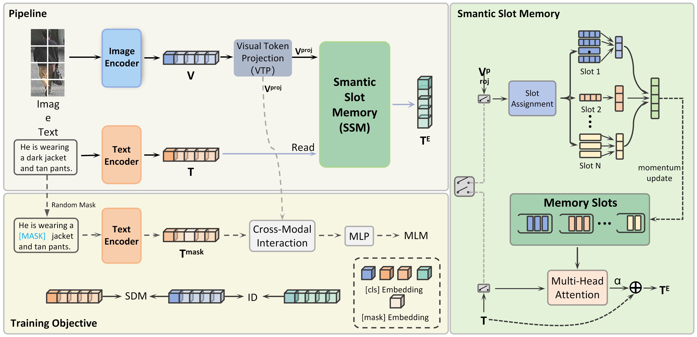
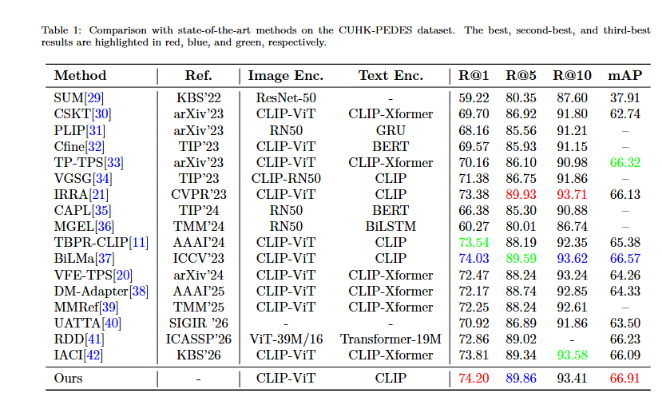
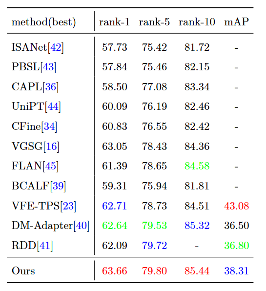
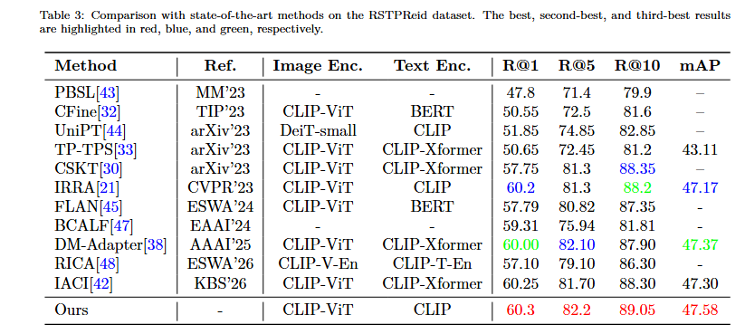

# VGTR: Vision-Guided Text Representation Learning for Text-based Person Re-Identification

## 1. Progect Overview
Text-based person retrieval aims to match pedestrian images with natural language descriptions and has attracted increasing attention in intelligent surveillance. Existing methods enhance textual representations through external knowledge, data augmentation, or generative reconstruction. However, these approaches mainly rely on text-only refinement and fail to fully exploit the rich visual semantics inherent in images, thereby limiting discriminative capability under semantically sparse descriptions. To address this issue, we propose a vision-guided text representation learning framework, termed VGTR, which enhances textual features by explicitly leveraging visual information. Specifically, we introduce a Semantic Slot Memory (SSM) module to capture diverse and stable visual semantic patterns, and a Visual Token Projection (VTP) module to align visual features with the textual embedding space. These components are seamlessly integrated into a unified training framework with carefully designed optimization objectives.Extensive experiments on CUHK-PEDES, ICFG-PEDES, and RSTPReid demonstrate that VGTR  outperforms state-of-the-art methods, achieving superior Rank-1 accuracy and mAP.


## 3. Key algorithm
  **Semantic Slot Memory (SSM) module:** The SSM organizes visual features into multiple semantic slots, where token-level information is softly aggregated and dynamically updated via a momentum mechanism, enabling structured and stable visual knowledge to guide text representation learning.
    
   **Visual-Text Projection module (VTP) module:** This module transforms visual representations into a space more compatible with textual embeddings, facilitating more reliable cross-modal interaction and memory retrieval.

## 4. Environment Setup
### Sofware Dependencies
```
Linux 6.8.0
Python 3.9.12
pytorch 2.6.0
torchvision 0.10.0
cuda 11.3
```
### Hardware Requirements
Nvidia L40 GPU with 48.00 GB
## 5. Installation and Usage
### Clone the repository
```bash
git clone https://github.com/junhaohe777/VGTR.git
```
### Prepare Datasets
Download the CUHK-PEDES dataset from [here](https://github.com/ShuangLI59/Person-Search-with-Natural-Language-Description), ICFG-PEDES dataset from [here](https://github.com/zifyloo/SSAN) and RSTPReid dataset form [here](https://github.com/NjtechCVLab/RSTPReid-Dataset)

Organize them in `your dataset root dir` folder as follows:
```
|-- your dataset root dir/
|   |-- <CUHK-PEDES>/
|       |-- imgs
|            |-- cam_a
|            |-- cam_b
|            |-- ...
|       |-- reid_raw.json
|
|   |-- <ICFG-PEDES>/
|       |-- imgs
|            |-- test
|            |-- train 
|       |-- ICFG_PEDES.json
|
|   |-- <RSTPReid>/
|       |-- imgs
|       |-- data_captions.json
```
### Training

```python
CUDA_VISIBLE_DEVICES=0 \
python train.py \
--name iira_decouple_features_id \
--img_aug \
--batch_size 128 \
--MLM \
--loss_names 'sdm+id+mlm' \
--dataset_name 'CUHK-PEDES' \
--num_epoch 60 \
--memory_size 32 \
--num_slots 4 \
--memory_alpha 0.01 \
--memory_momentum 0.9 \
--memory_warmup_epochs 5 \
--learnable_alpha true

```

## 6. Text-to-Image Person Retrieval Results
#### CUHK-PEDES dataset


#### ICFG-PEDES dataset


#### RSTPReid dataset



## 7. Acknowledgments
The code is based on [IRRA](https://github.com/anosorae/IRRA) licensed under Apache 2.0.

## 8. Citation
#### If you use this project's code,please cite our paper:
```bibtex
@article{He_2026_VGTR
  title={A2TE: Enhancing Detail Awareness for Text-Based Person Search via Attribute Assistance and Token Exploitation},
  author={He, Junhao and Zhang, Chengfang and Feng, Ziliang},
  journal={xxx},
  year={2026}
}
```
## 9. Contact Information
- **Email**: 2817881079@qq.com or chengfangzhang@scpolicec.edu.cn
